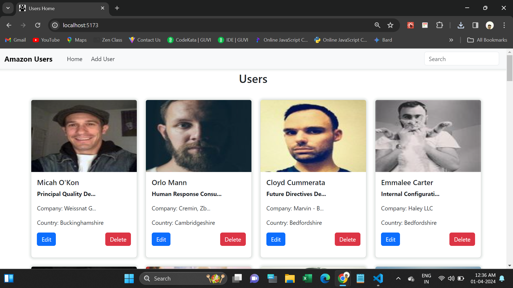
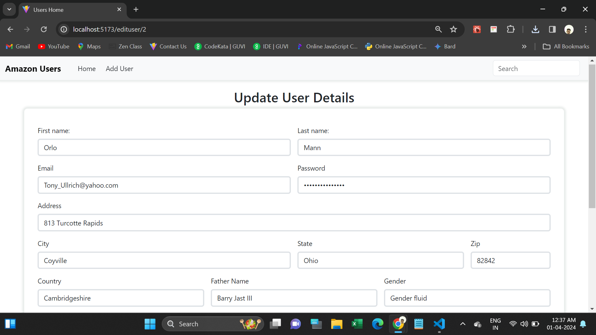
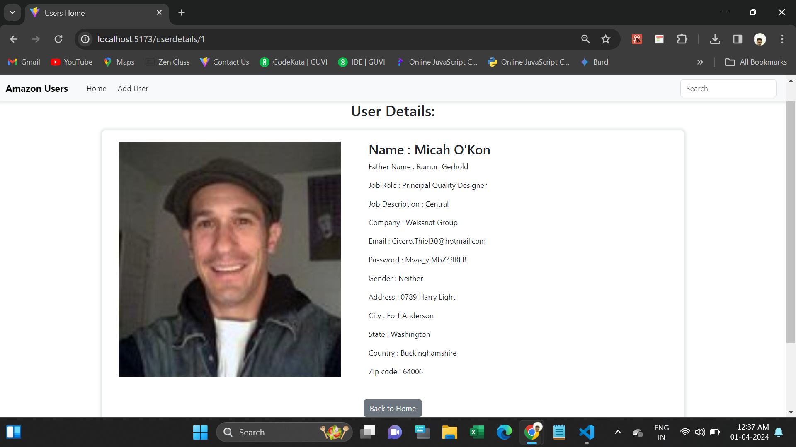

# React Axios Task

This webpage are managing users information.

All the data are fetching using Axios.

We can add, remove, update users.

In this page we can make CRUD operations.

 
All the data passed parent to child component through Context API.

 
It's fully Responsive.

  
It works with React Router-Dom.

   
  <h4>Used Tools.</h4>
<ul>
  <li>Html</li>
  <li>CSS</li>
  <li>Bootstrap</li>
  <li>Javascript</li>
  <li>React JS</li>
</ul>
 
<h4>Npm Packages are used:</h4>
<ul>
  <li>https://www.npmjs.com/package/bootstrap</li>
  <li>https://www.npmjs.com/package/react-router-dom</li>
  <li>https://www.npmjs.com/package/axios</li>
 <li>https://www.npmjs.com/package/react-toastify</li>
</ul>
 
<h3>Deployed URL</h3>
https://axiosuser-info.netlify.app/
 

<h5>Screenshots</h5>
1.Home Page

2.User updating Page

3.User adding page

4.User details page

